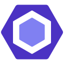

<h1 align="center">
    Faysal Ahammed—@faysalcsediu
      
    

        &nbsp;
        &nbsp;
        &nbsp;
        
    

</h1>

### 🧔 About Me :

    Hi, I'm Faysal—A Web Application Developer from Bangladesh . My core skill is based on JavaScript, and I like to use it for the majority of my tasks. I have graduated with a bachelor's degree in Computer Science and Engineering from Daffodil International University at Dhaka, Bangladesh in 2022. I am open to any type of career opportunity that aligns with my interests.

### 🛠️ Languages and Tools :

    &nbsp;
    &nbsp;
    &nbsp;
    &nbsp;
    &nbsp;
    &nbsp;
    &nbsp;
    &nbsp;
    &nbsp;
    &nbsp;
    &nbsp;
    &nbsp;
    &nbsp;
    &nbsp;
    &nbsp;
    &nbsp;
    &nbsp;
    
    
    
    
    
    

### 🏗️ Projects :
<table>
  <thead align="center">
    <tr border: none;>
      <td><b>Projects</b></td>
      <td><b>Description</b></td>
      <td><b>Source Code</b></td>
    </tr>
  </thead>
  <tbody>
    <tr>
      <td><a href="#" target="_blank">...</a></td>
      <td>...</td>
      <td>...</td>
    </tr>
    <tr>
      <td><a href="#" target="_blank">...</a></td>
      <td>...</td>
      <td>...</td>
    </tr>
  </tbody>
</table>
